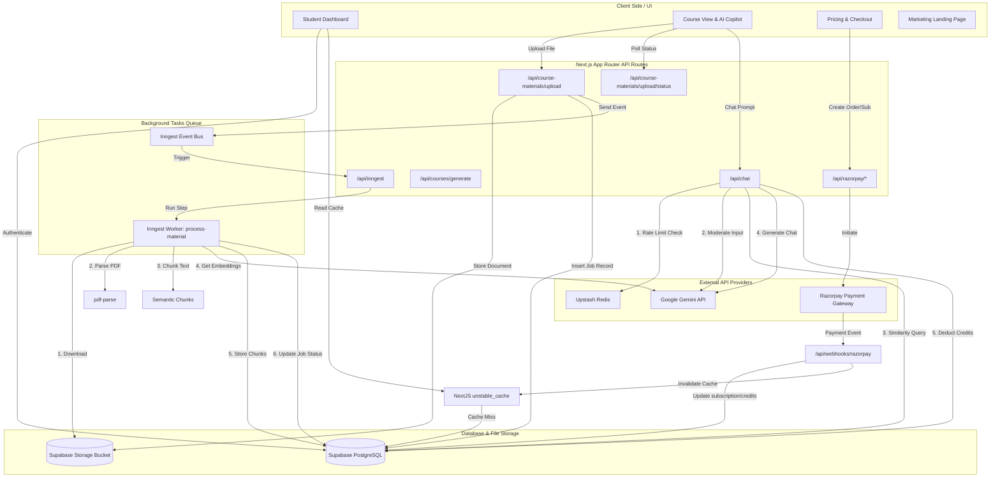
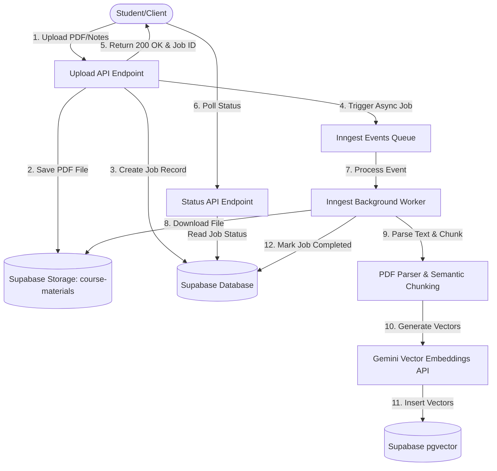

# Academia AI - Intelligent Learning Workspace

Academia AI is a production-grade, multi-tenant SaaS learning platform designed to help students study smarter. It features personalized AI curriculum generation, RAG-powered vector search chat over study materials, analytics, and billing, packaged inside a modern and responsive user interface.

This codebase is built on the **Next.js 16 (React 19)** runtime and has been optimized for serverless stability, high-performance edge caching, observability, and cost-effective AI safety boundaries.

---

## ✨ Core Features

*   **Dynamic Syllabus & Course Generation**: Instantly compile a full, multi-chapter academic curriculum dynamically from a simple topic prompt, powered by Google Gemini.
*   **RAG-Powered AI Copilot**: A context-aware chatbot widget utilizing Retrieval-Augmented Generation (RAG) to query, synthesize, and answer questions directly from uploaded study notes and books.
*   **Multi-Format Document Processing**: Asynchronous ingestion of PDF, TXT, and Markdown files. Features a frontend polling mechanism to update processing status in real time.
*   **Interactive Study Dashboard**: Beautiful, unified Bento-grid dashboard presenting course progress, average completion percentage, total course count, and remaining AI usage credits.
*   **Credit Top-up & Subscription Engine**: Integrates Razorpay overlay checkout supporting both one-time credit purchases and full Pro tier subscriptions.
*   **Observability & Controls**: Rate-limiting safeguards using Upstash Redis, client-to-server error telemetry via Sentry, and detailed event logging via PostHog tracking.
*   **Anonymized Contact Portal**: Feedback submission form with fully open public database insertion policies.

---

## 🗺️ System Architecture Flow

The following diagram outlines the system design, communication protocols, caching boundaries, and external API gateways:



---

## 🚀 Key Architectural Pillars



### 1. Asynchronous Background Job Processing (Inngest)
To prevent serverless function timeouts on massive PDF uploads, document parsing and vector indexing has been completely offloaded to an asynchronous background worker powered by **Inngest v4**:
- **Immediate Handshake**: The upload API `/api/course-materials/upload` uploads raw files directly to Supabase storage, inserts a tracking record in `course_materials_uploads` with a `processing` status, triggers an Inngest event, and instantly returns a `200 OK` with the tracking ID.
- **Background Worker**: An Inngest function `process-material` downloads the file, parses it (via `pdf-parse`), splits it into semantic chunks using overlapping boundary checks, requests 768-dimension vector embeddings from Gemini, and bulk-inserts them into the vector database.
- **Status Polling**: The client frontend polls `/api/course-materials/upload/status?upload_id=<id>` to render real-time processing indicators (processing, completed, or failed with specific error details).

### 2. High-Performance Caching System (`unstable_cache`)
To scale database resource consumption, database read operations are cached at the edge:
- **Cached Queries**: User profile information and active course libraries are cached using Next.js `unstable_cache`.
- **On-Demand Tag-Based Revalidation**: When mutations occur (such as adding a course, completing a course lesson, sending a message, verifying a payment, or updating settings), the cache is programmatically invalidated via `revalidateTag` on the server.
- **Webhook Integration**: Razorpay verification webhooks automatically invalidate cached tags to reflect subscription updates instantly.

### 3. Pre-Flight AI Content Moderation
Before triggering costly Gemini text generation or vector searches, all user prompt submissions are screened by a custom safety moderation utility:
- **Safety Screening**: Prompts are analyzed using Gemini to detect violence, self-harm, hate speech, harassment, or sexually explicit requests.
- **Graceful Blocking**: Offending inputs are rejected early with a `400 Bad Request` safety violation block, keeping AI costs down and user boundaries safe.

### 4. Billing, Idempotency, and Webhook Fallbacks (Razorpay)
- **Cryptographic Signature Verification**: Checks incoming Razorpay checkouts using HMAC-SHA256 signature verification to prevent tampering.
- **Double-Spend Protection**: Uses a PostgreSQL `processed_orders` table with a unique constraint on `order_id`. Any attempt to credit the same order twice is blocked with a `409 Conflict` database exception.
- **Webhook Fallbacks**: In case of client network dropouts during the checkout callback, the Razorpay `order.paid` webhook acts as a reliable fallback, checking the idempotency table and crediting the user if the client-side call did not complete.

### 5. Production Observability & Rate Limits
- **Sliding-Window Rate Limiting**: Implements a sliding window rate limiter (10 requests/minute) utilizing Upstash Redis. Falls back gracefully in local dev when credentials are absent.
- **Observability**: Complete frontend and backend error telemetry tracking integrated via Sentry.
- **Product Analytics**: Click tracking and AI copilot usage metrics sent to PostHog.
- **Credit Enforcements**: Courses API checks remaining user credits and atomic transactions deduct credits on successful generation.

---

## 🛠️ Tech Stack
- **Framework**: [Next.js 16 (React 19)](https://nextjs.org) using App Router & Turbopack
- **Styling**: Vanilla CSS with tailored utility variables supporting light/dark theme toggling, custom glassmorphism panels, and interactive hover mechanics.
- **Database**: [Supabase](https://supabase.com) (PostgreSQL vector storage, Row-Level Security, Storage Buckets, and Email/Google Auth)
- **AI Engine**: [Google Gemini SDK](https://github.com/google/generative-ai-js) via AI SDK
- **Task Queue**: [Inngest v4](https://inngest.com)
- **Rate Limiter**: [Upstash Redis](https://upstash.com)
- **Billing**: [Razorpay](https://razorpay.com)
- **Observability**: [Sentry](https://sentry.io) & [PostHog](https://posthog.com)

---

## 💾 Database Schema Setup (Supabase)

To set up the Postgres database, execute the following SQL scripts in the **Supabase SQL Editor** in the given order:

### 1. Main Schema & Auth Triggers
Creates the core tables and a trigger that auto-seeds courses and a profile on new user registration:

```sql
-- Create a profiles table for storing user data
CREATE TABLE IF NOT EXISTS public.profiles (
  id uuid REFERENCES auth.users ON DELETE CASCADE PRIMARY KEY,
  email text,
  subscription_tier text DEFAULT 'free' CHECK (subscription_tier IN ('free', 'pro', 'enterprise')),
  ai_credits_remaining integer DEFAULT 10,
  updated_at timestamp with time zone DEFAULT now(),
  razorpay_customer_id text,
  razorpay_subscription_id text
);

-- Enable Row Level Security (RLS)
ALTER TABLE public.profiles ENABLE ROW LEVEL SECURITY;

-- Create RLS policies for profiles
CREATE POLICY "Users can read their own profile" ON public.profiles
  FOR SELECT USING (auth.uid() = id);

CREATE POLICY "Users can update their own profile" ON public.profiles
  FOR UPDATE USING (auth.uid() = id) WITH CHECK (auth.uid() = id);

-- Create courses table
CREATE TABLE IF NOT EXISTS public.courses (
  id uuid PRIMARY KEY DEFAULT gen_random_uuid(),
  title text NOT NULL,
  progress integer NOT NULL DEFAULT 0,
  icon_name text NOT NULL DEFAULT 'BookOpen',
  user_id uuid REFERENCES auth.users ON DELETE CASCADE NOT NULL,
  created_at timestamp with time zone DEFAULT now()
);

-- Enable RLS on courses
ALTER TABLE public.courses ENABLE ROW LEVEL SECURITY;

-- Create RLS policies for courses
CREATE POLICY "Users can select their own courses" ON public.courses
  FOR SELECT USING (auth.uid() = user_id);

CREATE POLICY "Users can insert their own courses" ON public.courses
  FOR INSERT WITH CHECK (auth.uid() = user_id);

CREATE POLICY "Users can update their own courses" ON public.courses
  FOR UPDATE USING (auth.uid() = user_id) WITH CHECK (auth.uid() = user_id);

CREATE POLICY "Users can delete their own courses" ON public.courses
  FOR DELETE USING (auth.uid() = user_id);

-- Trigger to auto-create profile and seed courses
CREATE OR REPLACE FUNCTION public.handle_new_user()
RETURNS trigger AS $$
BEGIN
  INSERT INTO public.profiles (id, email, subscription_tier, ai_credits_remaining)
  VALUES (new.id, new.email, 'free', 10);

  INSERT INTO public.courses (title, progress, icon_name, user_id) VALUES
    ('Introduction to Web Development', 85, 'Laptop', new.id),
    ('Advanced React & Next.js App Router', 45, 'Globe', new.id),
    ('Framer Motion Animation Masterclass', 72, 'Sparkles', new.id),
    ('Database Design with Postgres & Supabase', 20, 'Database', new.id),
    ('Sleek Styling with Tailwind CSS', 95, 'Layers', new.id);

  RETURN new;
END;
$$ LANGUAGE plpgsql SECURITY DEFINER;

CREATE TRIGGER on_auth_user_created
  AFTER INSERT ON auth.users
  FOR EACH ROW EXECUTE FUNCTION public.handle_new_user();
```

### 2. Vector Search (pgvector)
Enables vector similarity search using HNSW indexing and a cosine-similarity RPC function matching Gemini's 768-dimension vectors:

```sql
-- Enable pgvector extension
CREATE EXTENSION IF NOT EXISTS vector;

-- Create course_materials table
CREATE TABLE IF NOT EXISTS public.course_materials (
  id uuid PRIMARY KEY DEFAULT gen_random_uuid(),
  course_id uuid REFERENCES public.courses(id) ON DELETE CASCADE NOT NULL,
  content text NOT NULL,
  embedding vector(768) NOT NULL,
  metadata jsonb DEFAULT '{}'::jsonb,
  created_at timestamp with time zone DEFAULT now()
);

-- Enable RLS
ALTER TABLE public.course_materials ENABLE ROW LEVEL SECURITY;

-- Create RLS policies
CREATE POLICY "Users can access materials for their own courses" ON public.course_materials
  FOR ALL USING (
    EXISTS (
      SELECT 1 FROM public.courses c
      WHERE c.id = course_materials.course_id
        AND c.user_id = auth.uid()
    )
  );

-- HNSW Vector Index for High-Performance Queries
CREATE INDEX IF NOT EXISTS course_materials_embedding_idx 
ON public.course_materials 
USING hnsw (embedding vector_cosine_ops);

-- Cosine similarity RPC function
CREATE OR REPLACE FUNCTION public.match_course_materials (
  query_embedding vector(768),
  match_threshold float,
  match_count int,
  filter_course_id uuid
)
RETURNS TABLE (
  id uuid,
  content text,
  similarity float
)
LANGUAGE plpgsql SECURITY DEFINER AS $$
BEGIN
  RETURN QUERY
  SELECT
    cm.id,
    cm.content,
    (1 - (cm.embedding <=> query_embedding))::float AS similarity
  FROM public.course_materials cm
  WHERE cm.course_id = filter_course_id
    AND (1 - (cm.embedding <=> query_embedding)) > match_threshold
  ORDER BY cm.embedding <=> query_embedding
  LIMIT match_count;
END;
$$;
```

### 3. File Uploads tracking & Idempotency
Tracks asynchronous upload statuses and prevents double-crediting Razorpay orders:

```sql
-- Upload tracking
CREATE TABLE IF NOT EXISTS public.course_materials_uploads (
  id uuid PRIMARY KEY DEFAULT gen_random_uuid(),
  course_id uuid REFERENCES public.courses(id) ON DELETE CASCADE NOT NULL,
  filename text NOT NULL,
  status text NOT NULL DEFAULT 'processing' CHECK (status IN ('processing', 'completed', 'failed')),
  error_message text,
  created_at timestamp with time zone DEFAULT now()
);

ALTER TABLE public.course_materials_uploads ENABLE ROW LEVEL SECURITY;

CREATE POLICY "Users can access uploads for their own courses" ON public.course_materials_uploads
  FOR ALL USING (
    EXISTS (
      SELECT 1 FROM public.courses c
      WHERE c.id = course_materials_uploads.course_id
        AND c.user_id = auth.uid()
    )
  );

-- Processed orders (idempotency)
CREATE TABLE IF NOT EXISTS public.processed_orders (
  order_id text PRIMARY KEY,
  user_id uuid REFERENCES auth.users ON DELETE CASCADE NOT NULL,
  payment_id text,
  created_at timestamp with time zone DEFAULT now()
);

ALTER TABLE public.processed_orders ENABLE ROW LEVEL SECURITY;

CREATE POLICY "Users can read their own processed orders" ON public.processed_orders
  FOR SELECT USING (auth.uid() = user_id);

CREATE POLICY "System can insert processed orders" ON public.processed_orders
  FOR INSERT WITH CHECK (auth.uid() = user_id);

-- Atomic credits modification helper
CREATE OR REPLACE FUNCTION public.increment_credits(user_id uuid, amount int)
RETURNS int AS $$
DECLARE
  new_balance int;
BEGIN
  UPDATE public.profiles
  SET ai_credits_remaining = COALESCE(ai_credits_remaining, 0) + amount
  WHERE id = user_id
  RETURNING ai_credits_remaining INTO new_balance;
  
  RETURN new_balance;
END;
$$ LANGUAGE plpgsql SECURITY DEFINER;
```

### 4. Public Submissions (Contact Form)
```sql
CREATE TABLE IF NOT EXISTS public.contact_submissions (
  id uuid DEFAULT gen_random_uuid() PRIMARY KEY,
  name text NOT NULL,
  email text NOT NULL,
  message text NOT NULL,
  created_at timestamp with time zone DEFAULT now()
);

ALTER TABLE public.contact_submissions ENABLE ROW LEVEL SECURITY;

CREATE POLICY "Allow anonymous insert access" ON public.contact_submissions
  FOR INSERT WITH CHECK (true);
```

### 5. Storage Buckets Configuration
1. Go to **Supabase Dashboard** > **Storage**.
2. Create a new bucket named **`course-materials`**.
3. Set the bucket to **Private** (recommended since study materials are private user data).
4. Create the following RLS policies under the **Storage Policies** tab for `course-materials`:
   - **Select / Insert / Update / Delete**: Allow operations only if authenticated and the path starts with `auth.uid()`.
     - *Policy Definition*: `(role() = 'authenticated')` and `(bucket_id = 'course-materials')`

---

## 📦 Directory Structure
```bash
├── src
│   ├── app
│   │   ├── (dashboard)                  # Authenticated student dashboard (Dark-mode only)
│   │   │   ├── analytics                # Learning and credit usage metrics page
│   │   │   ├── courses                  # Course catalogs, details, and study materials
│   │   │   ├── dashboard                # Progress metrics bento grid
│   │   │   ├── pricing                  # Billing checkout and subscriptions
│   │   │   └── settings                 # Profile configuration
│   │   ├── (marketing)                  # Public landing page (Light/Dark toggle support)
│   │   ├── api
│   │   │   ├── chat                     # Vector search & AI tutor copilot
│   │   │   ├── course-materials         # File uploading and status tracking
│   │   │   │   ├── upload
│   │   │   │   └── upload/status
│   │   │   ├── courses                  # Course management APIs
│   │   │   ├── inngest                  # Serve endpoint for Inngest background workers
│   │   │   └── razorpay                 # Order verification & webhook handlers
│   │   │       ├── create-order
│   │   │       ├── create-subscription
│   │   │       ├── verify-payment
│   │   │       └── webhooks
│   │   └── layout.tsx                   # Theme sync & analytics providers
│   ├── components                       # Reusable UI components
│   │   ├── AICopilot.tsx                # Chat and document RAG UI widget
│   │   ├── CourseGrid.tsx               # Bento-grid for courses display
│   │   └── PostHogProvider.tsx          # Analytics provider integration
│   ├── types                            # Database and billing TypeScript mappings
│   └── utils                            # Caching, chunking, moderation, and API helper keys
│       ├── cache.ts                     # Edge cache implementation (unstable_cache)
│       ├── chunk.ts                     # Overlapping text chunker
│       ├── moderation.ts                # Gemini safety filter
│       └── supabase                     # Database client constructors (server, admin)
├── tests
│   ├── e2e                              # Playwright browser automation
│   └── unit                             # Vitest unit tests
```

---

## ⚙️ Environment Configuration

Create a `.env.local` file in the root of the project with the following keys:

```env
# Supabase Project Credentials
NEXT_PUBLIC_SUPABASE_URL=https://<your-project-id>.supabase.co
NEXT_PUBLIC_SUPABASE_ANON_KEY=eyJhbGciOiJIUzI1NiIsInR5cCI6IkpXVCJ9...
SUPABASE_SERVICE_ROLE_KEY=eyJhbGciOiJIUzI1NiIsInR5cCI6IkpXVCJ9...

# Google Generative AI (Gemini)
GOOGLE_GENERATIVE_AI_API_KEY=AIzaSy...

# Upstash Redis (Rate Limiting)
UPSTASH_REDIS_REST_URL=https://<your-redis-instance>.upstash.io
UPSTASH_REDIS_REST_TOKEN=Abc...

# Inngest Server Keys (Background tasks)
INNGEST_EVENT_KEY=your_inngest_event_key
INNGEST_SIGNING_KEY=your_inngest_signing_key

# Sentry (Error Telemetry)
SENTRY_AUTH_TOKEN=sntryu_...

# PostHog Analytics
NEXT_PUBLIC_POSTHOG_KEY=phc_...
NEXT_PUBLIC_POSTHOG_HOST=https://us.i.posthog.com

# Razorpay Checkout Credentials
RAZORPAY_KEY_ID=rzp_test_...
RAZORPAY_KEY_SECRET=your_razorpay_secret
NEXT_PUBLIC_RAZORPAY_KEY_ID=rzp_test_...
RAZORPAY_PLAN_ID=plan_...
RAZORPAY_WEBHOOK_SECRET=your_webhook_secret
```

---

## 🛠️ Local Installation & Development

Follow these steps to run the platform locally:

```bash
# 1. Install Dependencies
npm install

# 2. Run Database Migrations
# (Ensure the SQL scripts under "Database Schema Setup" have been run in Supabase)

# 3. Start the Next.js Development Server
npm run dev

# 4. Start the Inngest Dev Server
# This intercepts background event dispatches and allows local visual execution debugging.
npx inngest-cli dev
```

- Access the Next.js dashboard: [http://localhost:3000](http://localhost:3000)
- Access the Inngest local development GUI: [http://localhost:8288](http://localhost:8288)

---

## 🧪 Testing Suite

### 1. Unit Tests (Vitest)
Unit tests cover isolated functions such as content moderation safety filtering and text chunking logic:
```bash
npm run test:unit
```

### 2. End-to-End Tests (Playwright)
E2E tests simulate full browser navigation flows, including unauthorized redirection tests and routing flows:
```bash
# Install Playwright browser engines (first time only)
npx playwright install

# Run tests
npm run test:e2e
```

---

## ⚠️ Troubleshooting & Common Pitfalls

- **`Failed to fetch cached profile: Cannot coerce the result to a single JSON object`**:
  Ensure your database contains a profile for your user. This error is triggered by Supabase if no rows match the user ID (usually due to Row Level Security blocking the request when querying with an unauthenticated client). We resolve this by querying with `createClient()` (authenticated) and using `.maybeSingle()` instead of `.single()`.
- **Inngest function not running**:
  Make sure you are running `npx inngest-cli dev` in a separate terminal. Next.js must be running at the same time so Inngest can send HTTP requests to `/api/inngest`.
- **Credits not updating**:
  Double check that you have run the `public.increment_credits` SQL RPC function in your Supabase SQL editor.
